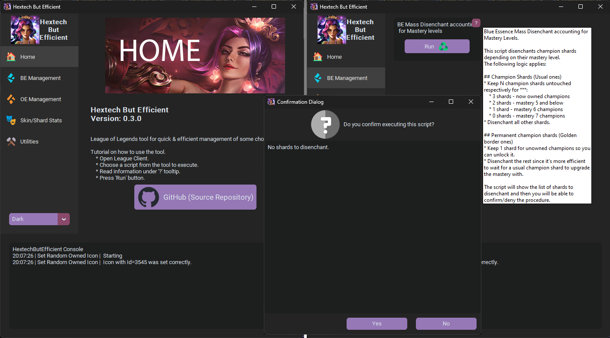

# 🔠 HextechButEfficient

League of Legends [LCU API](<https://riot-api-libraries.readthedocs.io/en/latest/lcu.html>) scripts for quick &amp; efficient management of some chores in a min-max style.

> **Note**
> You can use GUI from Release App as well as run yourself `main.py` or separate scripts in folder `scripts/` yourself.

No more annoying animations, no more chore calculations, no more chore lookups in other tab like "do I have mastery 7 on that champ?". Say "No more" to any inefficiency.

## 📔 Table of Contents

- [🔠 HextechButEfficient](#-hextechbutefficient)
  - [📔 Table of Contents](#-table-of-contents)
  - [📃 List of Scripts](#-list-of-scripts)
    - [🔵 Efficient BE (Blue Essence) management](#-efficient-be-blue-essence-management)
    - [🟠 Efficient OE (Orange Essence) management](#-efficient-oe-orange-essence-management)
    - [🤯 Utilities](#-utilities)
    - [💎 Skins and Skin Shards related statistics/math](#-skins-and-skin-shards-related-statisticsmath)
    - [⚙️ Backup/Restore Settings](#️-backuprestore-settings)
    - [🚢 Event Pass](#-event-pass)
    - [🪓 Final Chore minimisation](#-final-chore-minimisation)
  - [🪚 Ideas and Contributions](#-ideas-and-contributions)
  - [👊 Riot Games Approval](#-riot-games-approval)
  - [🚫 No Personal Responsibility Disclaimer](#-no-personal-responsibility-disclaimer)
  - [🌗 Last Note](#-last-note)
  - [🚒 Riot Games Disclaimer](#-riot-games-disclaimer)

## 📃 List of Scripts

The checkmark ☑️ in lists below means script is implemented. If not then it's coming soon™️.

For more info about the scripts check out [⚠️ the repository's wiki ⚠️](<https://github.com/Aluerie/HextechButEfficient/wiki>)

### 🔵 Efficient BE (Blue Essence) management

- [X] Mass-Disenchant Champion Shards accounting for Mastery levels.
- [ ] Mass-Open BE related loot.
- [ ] Upgrade Champion Mastery if available.

### 🟠 Efficient OE (Orange Essence) management

- [ ] Mass-Disenchant everything that gives OE.
- [ ] Mass-Open OE related loot.
- [ ] Waste all OE to upgrade the cheapest skin shards.
- [X] Show skin shards for champions without a skin.

### 🤯 Utilities

- [X] Remove Challenges Tokens
- [X] Set Random Icon
- [ ] Combine Key Fragments.
- [ ] Remove `isNew` shining (that you need to hover over to remove).

### 💎 Skins and Skin Shards related statistics/math

- [X] Prints statistic about your skin collection. Number of owned/not-owned skins per RP price tier.
- [X] Same^ for shards loot.

### ⚙️ Backup/Restore Settings

- [X] Backup settings to `.json` files.
- [X] Restore settings from `.json` files.

### 🚢 Event Pass

- [ ] Claim all rewards.
- [ ] Buy all skin orbs with a limit.

### 🪓 Final Chore minimisation

- [ ] Construct your own chore out of available scripts, gather it all in just one button and even schedule it.

## 🪚 Ideas and Contributions

Feel free to make contributions, reach me with your ideas and suggestions, report bugs, etc.

## 👊 Riot Games Approval

Sorry, I'm yet to send a request for approval.

Either way, it's more of a formality, you will not get banned for using this tool/scripts. Many similar applications that also use LCU API with different purposes already exist and have no problems. Honourable mention: [HextechButBetter](https://github.com/MaciejGorczyca/HextechButBetter) repository.

## 🚫 No Personal Responsibility Disclaimer

I am not to be held responsible for any losses, mistakes and "mistakes", or bugs that can lead to unfortunate situations. Use/modify my scripts on your own risk. Well, I mean, they should be fine, but still, if anything happens - I won't be able to refund those shards back or something.

## 🌗 Last Note

Not sure if I like the name `HextechButEfficient` because we have some non-loot scripts too. Not sure if wordplay of famous [HextechButBetter](https://github.com/MaciejGorczyca/HextechButBetter) project is a fine idea too. If you have any suggestions - please, hit me up.

## 🚒 Riot Games Disclaimer

`HextechButEfficient` is not endorsed by Riot Games and does not reflect the views or opinions of Riot Games or anyone officially involved in producing or managing Riot Games properties. Riot Games and all associated properties are trademarks or registered trademarks of Riot Games, Inc.
