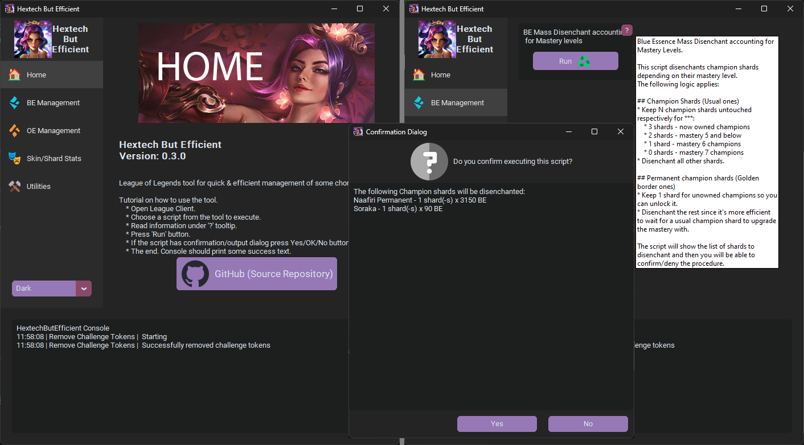
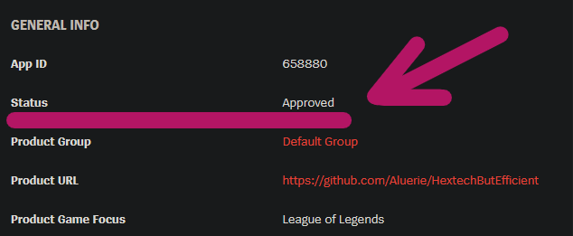

# 🔠 HextechButEfficient

League of Legends [LCU API](<https://riot-api-libraries.readthedocs.io/en/latest/lcu.html>) scripts for quick &amp; efficient management of some chores in a min-max style.

> [!NOTE]
> You can use GUI from [Release App](https://github.com/Aluerie/HextechButEfficient/releases) as well as run yourself `main.py` or separate scripts from the folder `scripts/` yourself.

No more annoying animations, no more chore calculations, no more chore lookups in other tab like "do I have mastery 7 on that champ?". Say "No more" to any inefficiency.

## 📔 Table of Contents

- [🔠 HextechButEfficient](#-hextechbutefficient)
  - [📔 Table of Contents](#-table-of-contents)
  - [📃 List of Scripts](#-list-of-scripts)
    - [🔵 BE (Blue Essence) management](#-be-blue-essence-management)
    - [🟠 OE (Orange Essence) management](#-oe-orange-essence-management)
    - [⚒️ Utilities](#️-utilities)
    - [🎭 Skins and Skin Shards related statistics](#-skins-and-skin-shards-related-statistics)
    - [⚙️ Backup/Restore Settings](#️-backuprestore-settings)
    - [🪓 Final Chore minimisation](#-final-chore-minimisation)
  - [🪚 Ideas and Contributions](#-ideas-and-contributions)
  - [👊 Riot Games Approval](#-riot-games-approval)
  - [🚫 No Personal Responsibility Disclaimer](#-no-personal-responsibility-disclaimer)
  - [🚒 No Relation to Riot Games Disclaimer](#-no-relation-to-riot-games-disclaimer)

## 📃 List of Scripts

The checkmark ☑️ in lists below means script is implemented. If not then it's coming soon™️.

### 🔵 BE (Blue Essence) management

- [X] Mass-Disenchant Champion Shards accounting for Mastery levels.
- [X] Mass-Open BE related loot.
- [ ] Upgrade Champion Mastery if available.

### 🟠 OE (Orange Essence) management

- [ ] Mass-Disenchant everything that gives OE.
- [ ] Mass-Open OE related loot.
- [ ] Waste all OE to upgrade the cheapest skin shards.
- [X] Show skin shards for champions without a skin.

### ⚒️ Utilities

- [X] Remove Challenge Tokens
- [X] Set Random Owned Icon
- [X] Combine Key Fragments.
- [ ] Claim all Event Pass rewards.
- [ ] Remove `isNew` shining (that you need to hover over to remove).

### 🎭 Skins and Skin Shards related statistics

- [X] Prints statistic about your skin collection. Number of owned/not-owned skins per RP price tier.
- [X] Same^ for shards loot.

### ⚙️ Backup/Restore Settings

- [X] Backup settings to `.json` files.
- [X] Restore settings from `.json` files.

### 🪓 Final Chore minimisation

- [ ] Construct your own chore out of available scripts, gather it all in just one button and even schedule it.

## 🪚 Ideas and Contributions

Feel free to make contributions, reach me with your ideas and suggestions, report bugs, etc.

## 👊 Riot Games Approval

This app has been approved by Riot!

That means, you will not be banned for using the tool. Either way, many already existing applications: like Mobalytics/Blitz or Open Source ones - honourable mention [HextechButBetter](https://github.com/MaciejGorczyca/HextechButBetter) (yes, the name of this repository is a reference to it 🙂 ) use LCU API for different purposes without any problems.

## 🚫 No Personal Responsibility Disclaimer

Despite section above, I am not to be held responsible for any losses, mistakes and "mistakes", or bugs that can lead to unfortunate situations. Use/modify my scripts on your own risk. Well, I mean, they should be fine, but still, if anything happens - I won't be able to refund those shards back or something.

Also, check out [LICENSE](./LICENSE) for more information about liability and warranty.

## 🚒 No Relation to Riot Games Disclaimer

`HextechButEfficient` is not endorsed by Riot Games and does not reflect the views or opinions of Riot Games or anyone officially involved in producing or managing Riot Games properties. Riot Games and all associated properties are trademarks or registered trademarks of Riot Games, Inc.
