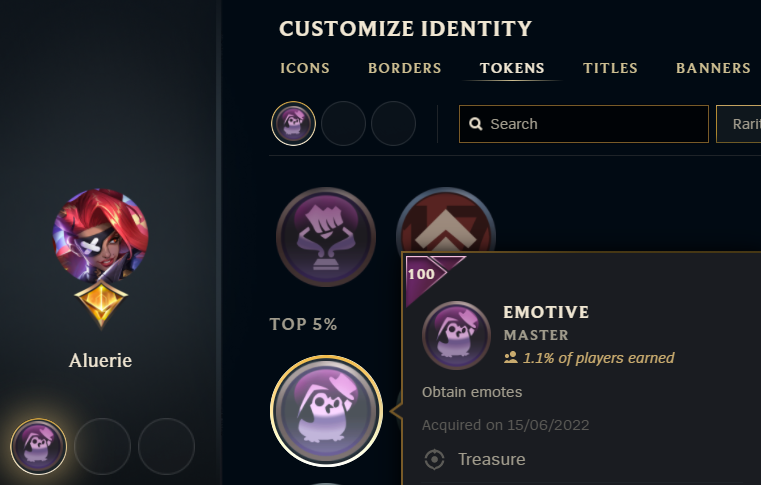

# HextechButEfficient

🔠League of Legends snippet scripts gathered in GUI for quick &amp; efficient loot (and not only) management in a min-max resources style (without long annoying animations too). Also some utility scripts that aren't about loot.

> **Warning**
> Unfortunately, I have not done GUI yet so for now it's only Python scripts that you can run yourself and see the output.

These Scripts mostly use [LCU API](<https://riot-api-libraries.readthedocs.io/en/latest/lcu.html>).

## 📔 Table of Contents

- [HextechButEfficient](#hextechbutefficient)
  - [📔 Table of Contents](#-table-of-contents)
  - [📃 List of Scripts](#-list-of-scripts)
    - [🔵 Champion Shards disenchant accounting for Mastery levels](#-champion-shards-disenchant-accounting-for-mastery-levels)
    - [😈 Remove Challenges Tokens](#-remove-challenges-tokens)
    - [⚙️ Backup/Restore Settings](#️-backuprestore-settings)
    - [🟠 Skins and Skin Shards related statistics/math](#-skins-and-skin-shards-related-statisticsmath)
  - [🪚 Ideas and Contributions](#-ideas-and-contributions)
  - [👊 Riot Games Approval](#-riot-games-approval)
  - [⚠️ No Personal Responsibility Disclaimer](#️-no-personal-responsibility-disclaimer)

## 📃 List of Scripts

### 🔵 Champion Shards disenchant accounting for Mastery levels

> **Note**
> This script is located in `scripts/be_management/`

When you disenchant the collection of your shards then if you want to keep levelling up your Champion Masteries in Future - you should be saving enough shards to upgrade those. It's simply cheaper than 2400 BE option. Thus when disenchanting your collection of champion shards for BE Emporium you want to

- keep 3 shards for champions you don't own
- keep 2 shards for your level 5 and below champions
- keep 1 shard for level 6 champions
- disenchant all remaining shards (i.e., level 7 ones or excess level 6 ones)

There are definitely some improvements to this strategy and more possible customisation, especially when I make GUI. But for now, let's start with this basic but _**most**_ needed strategy.

PS. Riot introduced Mass-Disenchant function into the client. But, unfortunately, it does not account for Champion Mastery levels like this script does. This is why I call this script BetterMassDisenchant. Soon even more features.

### 😈 Remove Challenges Tokens

> **Note**
> This script is located in `scripts/remove_tokens/`

For some reason, you can't deselect Challenge tokens in the following menu:

Well, fortunately, the script does exactly that: remove tokens from your profile - resetting it to a state with 3 empty tokens.

### ⚙️ Backup/Restore Settings

> **Note**
> This script is located in `scripts/settings/`

Self-explanatory, sometimes Riot Client behaves itself really badly and occasionally it might result in a total wipe out of your settings. It happened to me a few times. Yes, you can just back-up settings folder in installation directory or something. But here request settings from the client itself into `.json` files. There is also restore script.

### 🟠 Skins and Skin Shards related statistics/math

> **Note**
> This script is located in `scripts/skin_shards/`

If you buy a lot of event passes or hextech treasures, or abuse friend gifting mystery skin - at some point you start wondering "What's the most efficient way of grinding the skins collection (let it be all skins, subset of your favourite skins or just only one desired skin)? What's the best strategy?". After a bit you realise that those questions are really difficult to answer if we try to optimize as much as possible. However, let's try our best.

We will need Excel spreadsheet or similar table. And for the math here we would need to know our situation about skins/skin shards loot. The script fetches this info for you to copypaste. I'm not ready to share the excel yet since I'm not sure what format would be best for public.

## 🪚 Ideas and Contributions

Feel free to make contributions, reach me with your ideas, report bugs, etc.

## 👊 Riot Games Approval

Sorry, I'm yet to send a request for approval (all things that use LCU API are recommended to be certified by Riot) - I want to make GUI first.

Either way, it's more of a formality, you will not get banned. Many similar applications that also use LCU API with different purposes already exist and have no problems. Honourable mention: [HextechButBetter](https://github.com/MaciejGorczyca/HextechButBetter) repository.

## ⚠️ No Personal Responsibility Disclaimer

I am not to be held responsible for any losses, mistakes and "mistakes", or bugs that can lead to unfortunate situations. Use my scripts/modify them on your own risk. Well, I mean, my scripts should be fine, but still, if anything happens - I won't be able to refund those shards back or something.
